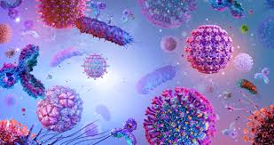
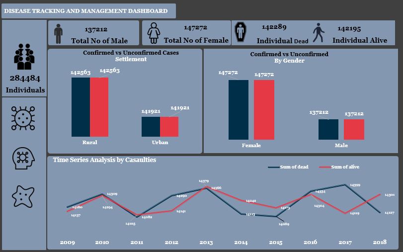

# Disease-Tracking-and-Management-Dashboard

##**Introduction**
This is a public health surveillance analysis designed for tracking and managing an outbreak of Neisseria meningitidis (Meningitis). It provides a comprehensive, multi-faceted overview of the outbreak by summarizing data on a total of 284,484 individuals. The dashboard is structured into two views, covering key epidemiological components: person (demographics like age, gender), place (rural/urban settlement, top affected states in Nigeria), and time (a historical 10-year trend). Its intended audience is likely public health officials, epidemiologists, and agencies like the Nigeria Centre for Disease Control (NCDC) who need to make data-driven decisions for intervention and resource allocation.

##**Problem Statement**
The dataset aims to answer critical public health questions essential for managing a disease outbreak:
1 What is the overall scale of the Meningitis outbreak and its severity, measured by the mortality rate?
2 Which demographic groups are most affected in terms of age, gender, and settlement type?
3 Which geographical areas (states) are the epicenters of the outbreak and require the most urgent response?
4 What is the historical trend of fatalities and survivals related to this disease over the past decade?
5 Which specific serotype of Neisseria meningitidis is the primary cause of the outbreak, in order to guide the correct vaccination strategy?

##**Skills Demonstrated**
The dashboard has demonstrated skills in:
1  Public Health Informatics: Understanding the key data points (demographics, geography, time series, agent characteristics) required for epidemiological surveillance.
2  Dashboard Design: Creating a visually cohesive and well-organized dashboard with a consistent layout, clear navigation sidebar, and a thematic color scheme appropriate for the serious subject matter.
3  Data Visualization: Using a variety of chart types (KPI cards, bar charts, line charts) to represent different aspects of the dataset.
4  KPI Development: Clearly defining and displaying high-level public health metrics, such as total cases, gender distribution, and overall mortality.

##**Actionable Insights**: The "Top 15 States affected by Disease" and "Serotype analysis" charts provide immediately actionable information crucial for deploying resources and selecting the appropriate vaccines.
1  Clear High-Level KPIs: The cards at the top of the dashboard clearly and concisely summarize the overall scale of the outbreak, including total numbers by gender and outcome (Alive vs. Dead). The totals are mathematically consistent.
2  Strong Visual Hierarchy: The layout guides the user's eye from high-level summaries to more detailed charts in a logical manner.

##**Recommendations**
For Public Health Action (Based on the Data):
1  Target High-Risk Demographics: The data shows the outbreak has an extremely high mortality rate (~50%) and disproportionately affects children under the age of 10. This group should be the absolute priority for vaccination campaigns and public awareness efforts.

2  Focus on High-Burden States: Resources—including vaccines, medical personnel, and supplies—should be strategically directed to the states most affected, particularly Ondo, Bayelsa, Yobe, and Niger.
3  Deploy Correct Vaccine: The "Serotype analysis" clearly shows Neisseria meningitidis group W as the dominant strain. Public health authorities must ensure the availability and deployment of vaccines that provide protection against this specific serotype (e.g., quadrivalent ACWY vaccines).
4  Investigate Rural vs. Urban Outcomes: Further research is needed to understand why survival rates appear slightly better in rural areas (50.3%) than in urban ones (49.9%). This could inform community-level health strategies.

